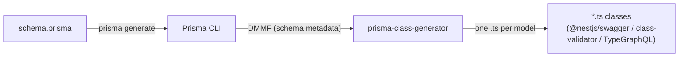

# Prisma Class Generator

[](https://www.npmjs.com/package/prisma-class-generator)
[](https://www.npmjs.com/package/prisma-class-generator)
[](https://github.com/kimjbstar/prisma-class-generator/actions/workflows/ci.yml)
[](./LICENSE)
[](./CONTRIBUTING.md)


See [CHANGELOG.md](./CHANGELOG.md) for release notes. Found a bug or want a feature? Open an
[issue](https://github.com/kimjbstar/prisma-class-generator/issues). Have a "how do I...?"
question instead? Ask in [Discussions](https://github.com/kimjbstar/prisma-class-generator/discussions) —
it's faster for you and keeps the issue tracker focused on actual bugs.

## Prisma

> [Prisma](https://www.prisma.io/) is a database ORM library for Node.js and TypeScript.

Prisma generates each model's type definitions directly from
[`schema.prisma`](https://www.prisma.io/docs/concepts/components/prisma-schema), so no
additional entry classes or repository layers are required.

That works well on its own, but it runs into a limitation with frameworks like NestJS: to use
`@nestjs/swagger`, an entity has to be defined as a class, and Prisma Client's generated types
aren't classes.

This tool closes that gap — it generates a TypeScript file per model based on `schema.prisma`.
The generated classes are formatted with prettier, using the user's prettier config file if
present, so defining classes by hand is no longer necessary while `schema.prisma` stays the
single source of truth.

Prisma Client's returned objects don't include a model's relational fields. This generator can
produce two separate files per model instead — one that matches Prisma Client's own interface,
and one that holds only the relational fields — by setting the _separateRelationFields_ option
to **true**. The default value is **false**.

## NestJS

> [NestJS](https://nestjs.com/) is a framework for building efficient, scalable Node.js server-side applications.

NestJS builds on classes and decorators as its basic structure. Defining a model as a class,
as below, makes it straightforward to apply [Swagger](https://docs.nestjs.com/openapi/introduction),
[TypeGraphQL](https://typegraphql.com/), and similar tools through decorators — and
regenerating the class whenever `schema.prisma` changes keeps the two in sync.

```typescript
export class Company {
	@ApiProperty({ type: Number }) // swagger
	@Field((type) => Int) // TypeGraphQL
	id: number

	@ApiProperty({ type: String }) // swagger
	name: string

	@ApiProperty({ type: Boolean }) // swagger
	isUse: boolean
}
```

With _separateRelationFields_ set to **true**, the two generated classes can be composed into a
class that contains only the relations you actually want. The example below uses
`@nestjs/swagger`'s composition helpers to create a class with all of `Product`'s own properties
plus just the `category` relation from the generated relations class.

```typescript
import { IntersectionType, PickType } from '@nestjs/swagger'
import { Product } from './product'
import { ProductRelations } from './product_relations'

export class ProductDto extends IntersectionType(
	Product,
	PickType(ProductRelations, ['category'] as const),
) {}
```

### Usage

1. **Install**

    ```shell
    npm install prisma-class-generator
    yarn add prisma-class-generator
    ```

2. **Define the generator in `schema.prisma`**

    ```prisma
    generator prismaClassGenerator {
        provider = "prisma-class-generator"
    }
    ```

    This generator reads the Prisma Client generator declared in the same schema to figure out
    where the client lives, so make sure one is present too — either the legacy
    `provider = "prisma-client-js"` or the newer `provider = "prisma-client"` (default since
    Prisma 7). Both are supported.

3. **Check the generated files**

    Given these models in `schema.prisma` — this is the exact
    `Product`/`Category`/`Company` example from [`prisma/postgresql.prisma`](./prisma/postgresql.prisma),
    the same schema this repo's own CI golden test runs against, so it won't drift out of sync
    with the real generator again:

    ```prisma
    enum ProductType {
      A
      B
      C
    }

    enum ProductAnotherType {
      AA
      BB
      CC
    }

    model Product {
      id            Int                @id
      title         String             @db.VarChar(255)
      desc          String             @default("abc") @db.VarChar(1024)
      images        Json               @db.Json
      isShown       Boolean?           @default(false)
      stock         Int?               @default(0)
      type          ProductType
      anotherType   ProductAnotherType @default(AA)
      averageRating Float?
      categoryId    Int
      companyId     Int
      category      Category           @relation(fields: [categoryId], references: [id])
      company       Company            @relation(fields: [companyId], references: [id])
      createdAt     DateTime           @default(now()) @db.Timestamp(6)
      updatedAt     DateTime           @updatedAt @db.Timestamp(6)
    }

    model Category {
      id       Int       @id
      products Product[]
    }

    model Company {
      id                      Int       @id
      name                    String
      totalIncome             BigInt    @default(100)
      lat                     Decimal
      lng                     Decimal
      by                      Bytes
      products                Product[]
      tags                    String[]
      tagsWithEmptyDefault    String[]  @default([])
      tagsWithDefault         String[]  @default(["a", "b"])
      numTags                 Int[]
      numTagsWithEmptyDefault Int[]     @default([])
      numTagsWithDefault      Int[]     @default([1, 2])
    }
    ```

    these classes are generated in <PROJECT_PATH>/src/\_gen/prisma-class — this is the real,
    unedited output of running the generator against the schema above:

    ( The generating path can be customized through _output_ option. )

    ```typescript
    // category.ts
    import { Product, type Product as ProductAsType } from './product'
    import { ApiProperty } from '@nestjs/swagger'

    export class Category {
    	@ApiProperty({ type: Number })
    	id: number

    	@ApiProperty({ isArray: true, type: () => Product })
    	products: ProductAsType[]
    }
    ```

    ```typescript
    // company.ts
    import { Product, type Product as ProductAsType } from './product'
    import { ApiProperty } from '@nestjs/swagger'

    export class Company {
    	@ApiProperty({ type: Number })
    	id: number

    	@ApiProperty({ type: String })
    	name: string

    	@ApiProperty({ type: BigInt })
    	totalIncome: BigInt = BigInt(100)

    	@ApiProperty({ type: Number })
    	lat: number

    	@ApiProperty({ type: Number })
    	lng: number

    	@ApiProperty({ type: Buffer })
    	by: Buffer

    	@ApiProperty({ isArray: true, type: () => Product })
    	products: ProductAsType[]

    	@ApiProperty({ isArray: true, type: String })
    	tags: string[]

    	@ApiProperty({ isArray: true, type: String })
    	tagsWithEmptyDefault: string[] = []

    	@ApiProperty({ isArray: true, type: String })
    	tagsWithDefault: string[] = ['a', 'b']

    	@ApiProperty({ isArray: true, type: Number })
    	numTags: number[]

    	@ApiProperty({ isArray: true, type: Number })
    	numTagsWithEmptyDefault: number[] = []

    	@ApiProperty({ isArray: true, type: Number })
    	numTagsWithDefault: number[] = [1, 2]
    }
    ```

    ```typescript
    // product.ts
    import { Category, type Category as CategoryAsType } from './category'
    import { Company, type Company as CompanyAsType } from './company'
    import { ProductType, ProductAnotherType } from '@prisma/client'
    import { ApiProperty, ApiPropertyOptional } from '@nestjs/swagger'

    export class Product {
    	@ApiProperty({ type: Number })
    	id: number

    	@ApiProperty({ type: String })
    	title: string

    	@ApiProperty({ type: String, example: 'abc' })
    	desc: string = 'abc'

    	@ApiProperty({ type: Object })
    	images: object

    	@ApiPropertyOptional({ type: Boolean, example: false })
    	isShown?: boolean = false

    	@ApiPropertyOptional({ type: Number, example: 0 })
    	stock?: number = 0

    	@ApiProperty({ enum: ProductType, enumName: 'ProductType' })
    	type: ProductType

    	@ApiProperty({
    		enum: ProductAnotherType,
    		enumName: 'ProductAnotherType',
    		example: ProductAnotherType.AA,
    	})
    	anotherType: ProductAnotherType = ProductAnotherType.AA

    	@ApiPropertyOptional({ type: Number })
    	averageRating?: number

    	@ApiProperty({ type: Number })
    	categoryId: number

    	@ApiProperty({ type: Number })
    	companyId: number

    	@ApiProperty({ type: () => Category })
    	category: CategoryAsType

    	@ApiProperty({ type: () => Company })
    	company: CompanyAsType

    	@ApiProperty({ type: Date })
    	createdAt: Date

    	@ApiProperty({ type: Date })
    	updatedAt: Date
    }
    ```

    Note that optional fields with a schema-level default (`isShown`, `stock`, `totalIncome`,
    the `tags*`/`numTags*` arrays above) are generated with that default value already
    assigned, so a `new Product()` starts in a valid state without every caller having to set
    them. And notice that relation fields (`category`/`company`/`products` above) import both
    the real class *and* a `type ... as ...AsType` alias — the field's own type annotation uses
    the alias to avoid a circular-import crash under `emitDecoratorMetadata`; see this repo's
    [CLAUDE.md](./CLAUDE.md) if you're curious why.

    ```typescript
    // index.ts
    import { Product as _Product } from './product'
    import { Category as _Category } from './category'
    import { Company as _Company } from './company'

    export namespace PrismaModel {
    	export class Product extends _Product {}
    	export class Category extends _Category {}
    	export class Company extends _Company {}

    	export const extraModels = [Product, Category, Company]
    }
    ```

    Classes are grouped into the `PrismaModel` namespace and re-exported through `index.ts` for
    two reasons:

    1. Generated class names can otherwise collide with the model types Prisma itself generates.
    2. When wiring up Swagger in NestJS, `extraModels` can point at this one array instead of
       listing every generated class individually in bootstrap code.

    For example:

    ```typescript
    // main.ts in a NestJS application
    import { PrismaModel } from './_gen/prisma-class'

    const document = SwaggerModule.createDocument(app, options, {
    	extraModels: [...PrismaModel.extraModels],
    })
    ```

    You can also disable it through the _makeIndexFile_ option.

#### Supported options

-   _dryRun_
    -   Controls whether files are written to disk or just printed to the terminal. default value is **true**
        -   once the printed preview looks right, set this option to **false** to actually write the files
-   _output_
    -   sets output path. default is **'../src/\_gen/prisma-class'**
-   _useSwagger_
    -   generates swagger decorator (`@ApiProperty`/`@ApiPropertyOptional` from `@nestjs/swagger`). default value is **true**
        -   a field's `///` doc comment (minus any `@directive` tokens) becomes the decorator's `description` — see [Per-field directives](#per-field-directives) below for the directives themselves
        -   a literal `@default(...)` (e.g. `@default("abc")`, `@default(1)`, an enum default) becomes the decorator's `example`. Function-based defaults (`now()`, `autoincrement()`, `dbgenerated()`) and `BigInt`/`DateTime` defaults are skipped — there's no single literal worth showing
        -   both are derived straight from the schema, not guessed, so they're always on when `useSwagger` is — no separate option
-   _useGraphQL_
    -   generates TypeGraphQL decorator (`@Field` from `@nestjs/graphql`). default value is **false**
-   _useValidation_
    -   generates [class-validator](https://github.com/typestack/class-validator) decorators (`@IsInt`, `@IsString`, `@IsOptional`, `@IsEnum`, `@IsArray`, ...) based on each field's Prisma type, for use with NestJS's `ValidationPipe`. default value is **false**
        -   relation and composite-type fields are intentionally left without a validator — this library hands DTO composition to the caller (see the FAQ below), so it doesn't guess what a nested payload should look like
        -   `DateTime` fields use `@IsDateString()` rather than `@IsDate()`, so it validates the raw string a JSON request body actually contains without requiring `class-transformer`'s `@Type(() => Date)` to run first
        -   `BigInt`/`Bytes`/`Json` fields get no type-specific validator — class-validator has no direct equivalent for those
        -   a field's `@db.*` native type sharpens the validator further when it describes a real
            constraint, on **Prisma 6+ only** (Prisma 5's DMMF doesn't expose native types at all —
            this silently falls back to the type-based validator above, no error): `@db.Uuid`/
            `@db.UniqueIdentifier` → `@IsUUID()`, MongoDB's `@db.ObjectId` → `@IsMongoId()`,
            postgresql/cockroachdb's `@db.Inet` → `@IsIP()` (all three replace the generic
            `@IsString()`), `@db.VarChar(n)`/`@db.Char(n)`/sqlserver's N-prefixed variants/
            cockroachdb's `@db.String(n)` → `@IsString()` + `@MaxLength(n)`, MySQL's unsigned
            integer types → `@IsInt()` + `@Min(0)`
            -   deliberately *not* covered: MySQL's `@db.UnsignedBigInt` — it maps to Prisma's
                `BigInt` scalar, and class-validator's `@Min()`/`@Max()` require
                `typeof value === 'number'`, which a `BigInt` value never satisfies (its `typeof`
                is `'bigint'`) — adding it would reject every value, including valid ones
-   _validateNestedRelations_
    -   requires `useValidation`. Adds `@ValidateNested()` (`{ each: true }` for list relations)
        to relation and composite-type fields, so NestJS's `ValidationPipe` (with
        `transform: true`) recurses into nested payloads instead of leaving them unvalidated.
        default value is **false**
    -   off by default because it's an opt-in to a specific DTO shape (see the FAQ) — turn it on
        if your relation fields *are* the nested payload you want validated as-is, not a DTO
        with a different nested shape
    -   pulls in class-transformer's `@Type(() => X)` alongside `@ValidateNested()` — see
        `useSerialization` below, which generates the same `@Type()` independently of
        validation; the two don't double up if both are on
-   _makeIndexFile_
    -   makes index file, default value is **true**
-   _separateRelationFields_
    -   puts relational fields into different file for each model. This way the class will match the object returned by a Prisma query, default value is **false**
-   _makeDtoFiles_
    -   also generates `Create<Model>` and `Update<Model>` classes for each model, default value is **false**
        -   they're **compositions**, not copies: `CreateUser extends OmitType(User, [...] as const)` and `UpdateUser extends PartialType(CreateUser)`, so each field's type, Swagger metadata and validators stay declared in exactly one place (NestJS's mapped types carry all three through)
        -   imported from `@nestjs/swagger` when `useSwagger` is on, otherwise from `@nestjs/mapped-types`
        -   a field is omitted from `Create` only when the schema itself says the client can't supply it: a **function-based** `@default(...)` (`autoincrement()`, `uuid()`, `cuid()`, `now()`, `auto()`, `dbgenerated(...)`), `@updatedAt`, or a relation field. A *literal* default like `@default(0)` is kept — "there's a fallback" isn't "you may not set it" — and so is a relation's foreign-key scalar (`authorId`), which is the value a REST client actually posts
        -   an `@id` **without** a default (e.g. `id String @id`) is kept too: the caller has to provide it
        -   composite types (MongoDB `type` blocks) get no DTOs — they're embedded values, not entities with their own endpoints
        -   with `separateRelationFields`, the DTOs compose the base class (never the `*Relations` one)
-   _clientImportPath_
    -   set prisma client import path manually, default value is **@prisma/client**
        -   set this explicitly when using Prisma 7's `prisma-client` generator, since its output is no longer `@prisma/client` by default
-   _useNonNullableAssertions_
    -   Adds a `!` after non-optional class fields, to avoid TypeScript strict mode's "Property has no initializer and is not definitely assigned in the constructor" warning
-   _preserveDefaultNullable_
    -   Controls how nullable fields are typed. When **false** (default), nullable fields are typed as `undefined` instead of `null`. When **true**, the field keeps Prisma's own nullable type (`| null`) instead.
-   _useUndefinedDefault_
    -   Assigns `= undefined` to fields with no default value, so every class field has an explicit initializer. default value is **false**
-   _preserveDecimal_
    -   Generates `Decimal` fields as `Prisma.Decimal` instead of `number`, avoiding precision loss for values like money. default value is **false**
        -   only changes the field's own TS type — the swagger/graphql decorator options stay `Number`/`Float`, since `Decimal` has no OpenAPI/GraphQL representation of its own
-   _useSerialization_
    -   generates class-transformer's `@Exclude()`/`@Expose()` for fields marked with the `/// @exclude`/`/// @expose` directives (see below), for use with NestJS's `ClassSerializerInterceptor`. default value is **false**
        -   the field stays on the class (unlike `/// @skip`) — only the serialized JSON response drops it
        -   also adds `@Type(() => X)` to relation and composite-type fields, independently of
            `useValidation` — without it, a `ClassSerializerInterceptor`/`plainToInstance()` call
            leaves a nested relation as a plain object instead of an instance of the related
            class, so that class's own `@Exclude()`/`@Expose()` decorators never get applied to it

#### Per-field directives

These are set per-field with a `///` doc comment directly above the field in `schema.prisma` — a regular `//` comment won't work, since Prisma's DMMF only exposes triple-slash doc comments.

-   `/// @skip`
    -   Excludes the field entirely from the generated class (and from any relation/import it would otherwise pull in). Useful for auto-populated columns like `id`, `createdAt`, `updatedAt` that don't belong on a create/update DTO.
        ```prisma
        model Product {
          id Int @id @default(autoincrement())
          /// @skip
          createdAt DateTime @default(now())
          title     String
        }
        ```
-   `/// @ApiHideProperty`
    -   Keeps the field on the class but adds `@ApiHideProperty()` (from `@nestjs/swagger`), hiding it from the generated OpenAPI docs. Only applies when `useSwagger` is on. Useful for fields like `passwordHash` that the class still needs at the type level but shouldn't be documented.
        ```prisma
        model User {
          id Int @id @default(autoincrement())
          /// @ApiHideProperty
          passwordHash String
        }
        ```
-   `/// @exclude`
    -   Keeps the field on the class but adds class-transformer's `@Exclude()`, so a `ClassSerializerInterceptor` strips it from the actual JSON response. Only applies when `useSerialization` is on. Unlike `@ApiHideProperty` (which only hides it from docs), this changes runtime behavior — the field genuinely won't be in the response body.
        ```prisma
        model User {
          id Int @id @default(autoincrement())
          /// @exclude
          passwordHash String
        }
        ```
-   `/// @expose`
    -   `@exclude`'s counterpart, for the opposite class-transformer strategy: adds `@Expose()`
        so the field survives a `plainToInstance(cls, data, { excludeExtraneousValues: true })`
        call, where every field is hidden by default unless explicitly marked. Only applies when
        `useSerialization` is on.
        ```prisma
        model User {
          id Int @id @default(autoincrement())
          /// @expose
          displayName String
        }
        ```

### Supported databases

Prisma normalizes every connector's column types down to the same DMMF scalar set, so this
generator works the same way regardless of database. Verified end-to-end (and covered by
[golden tests](./prisma) in this repo) against every database Prisma ORM currently supports:

-   PostgreSQL
-   MySQL
-   MongoDB (including composite `type` blocks)
-   SQL Server (mssql)
-   SQLite
-   CockroachDB

Native-type annotations (`@db.VarChar`, `@db.Money`, `@db.ObjectId`, ...) never change a
field's own TS type — that still comes from the DMMF scalar type (`String`, `Int`, ...), not
the underlying column. On Prisma 6+ they *do* sharpen `useValidation`'s output for a handful
of well-known types (see `useValidation` above) — that's the one place native types are read
at all; everywhere else they're still invisible to this generator. Two connector-level limits
are worth knowing, though they're Prisma restrictions rather than anything this generator controls: SQL Server and SQLite don't support
Prisma's native `enum`, and Prisma's `Unsupported("...")` escape-hatch type is excluded from
the DMMF entirely (so it never reaches Prisma Client either).

### Supported Prisma versions

Tested against Prisma **5, 6, and 7**, including both the legacy `prisma-client-js` generator
and the `prisma-client` generator that became the default in Prisma 7.

### How it works?

Prisma internally represents schema metadata as a DMMF (Data Model Meta Format) object.

[prisma-class-generator](https://github.com/kimjbstar/prisma-class-generator) reads that DMMF to
automate class definitions. It's declared as an additional generator in `schema.prisma` and runs
as part of the `prisma generate` process.



### Feature

-   Generates classes from Prisma model definitions
-   Supports basic scalar types and relations
-   Optionally generates Swagger decorators
-   Optionally generates TypeGraphQL decorators
-   Optionally generates class-validator decorators, sharpened further by `@db.*` native types on Prisma 6+ (`@IsUUID()`, `@IsMongoId()`, `@IsIP()`, `@MaxLength()`, `@Min(0)`)
-   Formats generated classes with prettier, using the user's prettier config file if present
-   Per-field `/// @skip`, `/// @ApiHideProperty`, `/// @exclude`, and `/// @expose` directives
-   Optionally generates class-transformer decorators (`@Exclude()`/`@Expose()` from
    `/// @exclude`/`/// @expose`, `@Type()` on relation/composite fields) for use with
    `ClassSerializerInterceptor`
-   `preserveDecimal` option to keep `Decimal` fields precision-safe as `Prisma.Decimal`
-   Doc comments and literal `@default(...)` values become Swagger `description`/`example`
-   Optional `Create`/`Update` DTO classes (`makeDtoFiles`), generated as NestJS mapped-type
    compositions so field definitions are never duplicated

### Future Plan

-   Support custom path, case or name per each model

---

### Comparison with similar tools

A few other Prisma generators solve overlapping problems. This is meant to help you pick the
right one, not to talk anyone out of the alternatives — they're good tools with a different
shape.

| | prisma-class-generator | [prisma-class-validator-generator](https://github.com/omar-dulaimi/prisma-class-validator-generator) | [prisma-generator-nestjs-dto](https://github.com/Brakebein/prisma-generator-nestjs-dto) |
|---|---|---|---|
| Swagger decorators | ✅ | ✅ | ✅ |
| class-validator decorators | ✅ | ✅ | ✅ |
| GraphQL (TypeGraphQL) decorators | ✅ | — | — |
| Classes generated per model | 1, or 3 with `makeDtoFiles` (`Model`, `CreateModel`, `UpdateModel`), or 2 with `separateRelationFields` | 1 (or 2 with `separateRelationFields`) | 5 (`Entity`, `Dto`, `CreateDto`, `UpdateDto`, `ConnectDto`) |
| Create/Update DTO strategy | mapped-type composition — `OmitType`/`PartialType` over the model class, so a field is declared once | — | fully expanded classes, each field re-declared per DTO |
| Databases verified against | postgresql, mysql, mongodb, sqlserver, sqlite, cockroachdb ([golden-tested](./prisma)) | not specified in their docs | not specified in their docs |
| Prisma versions | 5, 6, 7 (both `prisma-client-js` and `prisma-client`) | `>=6.19 <8` (peer dependency) | not version-pinned |
| Per-field customization | `/// @skip`, `/// @ApiHideProperty`, `/// @exclude` doc-comment directives | schema-comment annotations (e.g. `@description`) | schema-comment annotations (e.g. `@description`, `@minimum`) |
| Native-type-aware validators | `@db.Uuid`/`@db.ObjectId`/`@db.Inet`/`@db.VarChar(n)`/unsigned ints → sharper class-validator decorators (Prisma 6+) | not specified in their docs | not specified in their docs |

If you want a class per model that mirrors what Prisma Client actually returns — optionally with
`Create`/`Update` DTOs composed from it rather than duplicated out of it — this library is a good
fit. If you'd rather have a full Create/Update/**Connect** DTO set with each field expanded per
class, `prisma-generator-nestjs-dto` makes more of those decisions for you.

---

### FAQ

**1. Is it a CRUD generator?**

No — it doesn't provide functionality like `nestjs generate crud`. That's out of scope for this
library, which focuses on **defining classes** and leaves how those classes get used up to the
developer. It's meant as a bridge connecting a Prisma model to an entity/DTO class, not an
end-to-end code generator — a narrower scope keeps it adaptable to different projects.

**2. Does it only work with NestJS?**

No. It pairs particularly well with NestJS because the generated classes lean on the same
class-and-decorator patterns NestJS already builds on (`@nestjs/swagger`, `@nestjs/graphql`,
`class-validator`) — but any framework built around `reflect-metadata`-based class decorators can
use the generated classes just as directly.

**3. OK, so how do I actually build Create/Update DTOs from the generated class?**

Set `makeDtoFiles = "true"` and they're generated for you (see the option above) — as
compositions of the model class, so no field is ever declared twice:

```typescript
// create_user.ts
export class CreateUser extends OmitType(User, ['id', 'createdAt', 'updatedAt'] as const) {}

// update_user.ts
export class UpdateUser extends PartialType(CreateUser) {}
```

The omit list comes only from things the schema states outright — a function-based
`@default(...)`, `@updatedAt`, or a relation field — never from guessing at field names.

If your API's create payload differs from that (an admin route that *does* set `id`, a
`ConnectDto`-style nested write, a field you want dropped for reasons the schema doesn't
express), write it by hand — the generated class is decorated with `@nestjs/swagger`'s
`@ApiProperty`, which is exactly what `PartialType`/`OmitType`/`PickType` are designed to
compose, so this has always worked without any generator support:

```typescript
import { OmitType, PartialType } from '@nestjs/swagger'
import { User } from './_gen/prisma-class/user'

// omit auto-generated / server-controlled fields for creation
export class CreateUserDto extends OmitType(User, ['id', 'createdAt', 'updatedAt'] as const) {}

// every field optional, for a PATCH-style update
export class UpdateUserDto extends PartialType(CreateUserDto) {}
```

A hand-written DTO and `makeDtoFiles` coexist fine — the generated `CreateUser`/`UpdateUser`
are ordinary classes you can ignore, extend, or `OmitType` further.

**4. I'm getting a decorators error (e.g. Babel's `Missing plugin "decorators"`) when I import a generated class — what's missing?**

The generated classes use TypeScript's experimental (legacy) decorators, so the project
*consuming* them needs to support that syntax:

-   **Compiling with `tsc`**: set `"experimentalDecorators": true` in `tsconfig.json` — and
    `"emitDecoratorMetadata": true` too if you rely on decorator-derived type metadata (e.g.
    NestJS's dependency injection, or `@nestjs/swagger`'s type inference).
-   **Compiling with Babel** (e.g. a Next.js or Create React App-based toolchain): add
    [`@babel/plugin-proposal-decorators`](https://babeljs.io/docs/babel-plugin-proposal-decorators)
    with the `{ legacy: true }` option.

A NestJS project already ships with `experimentalDecorators`/`emitDecoratorMetadata` enabled by
default, so this typically only comes up when the generated classes are consumed from a
non-NestJS TypeScript or Babel project.
